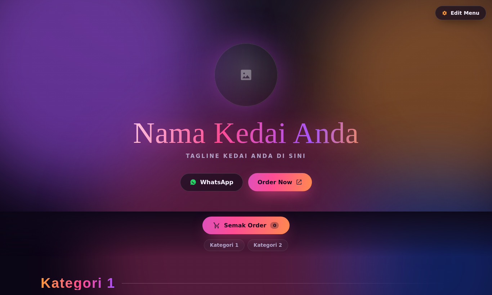
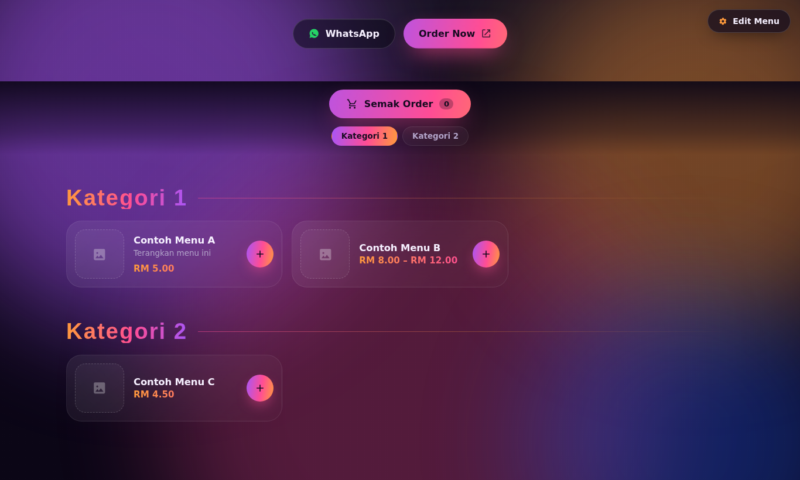
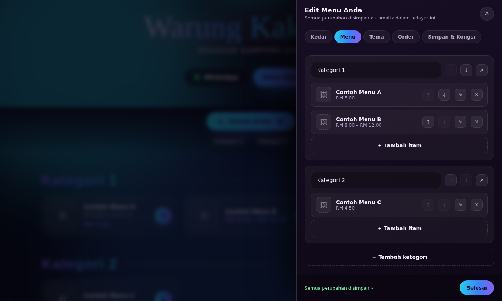
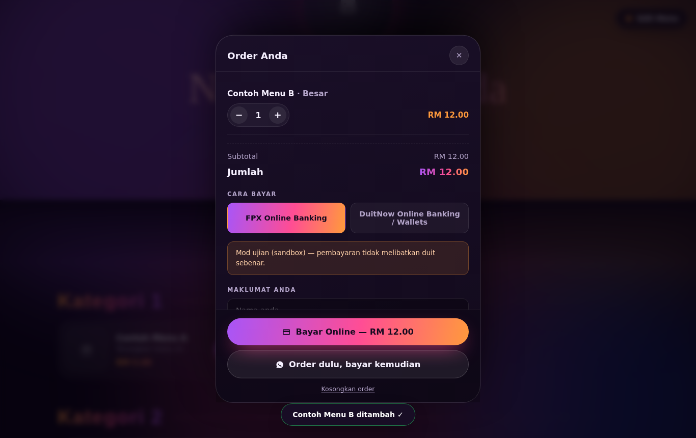
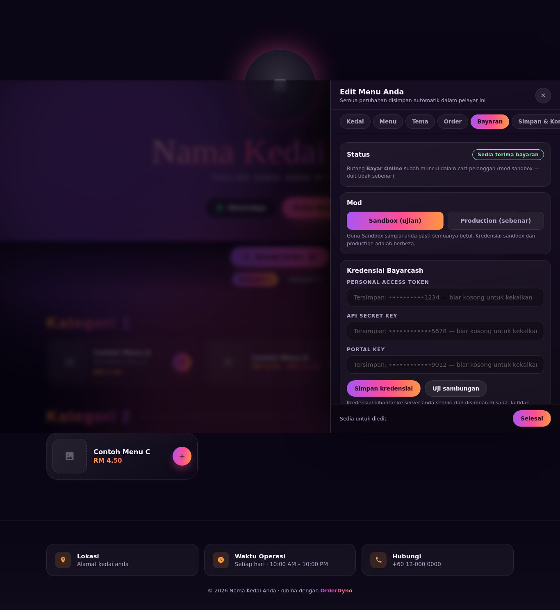
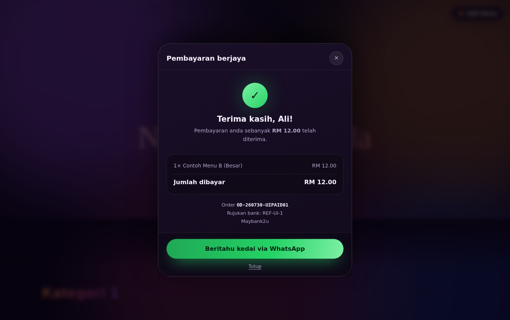

# 🛒 OrderDyno — Template Menu Online + Order WhatsApp

Template website ordering untuk kedai kecil, kafe, gerai dan penjaja.
Pelanggan pilih menu → masuk cart → **order terus masuk ke WhatsApp anda**.

**Yang paling penting: pemilik kedai boleh isi menu sendiri tanpa sentuh code.**
Tekan butang **⚙ Edit Menu** di penjuru atas, isi semuanya dari borang.

Tiada database, tiada langganan bulanan — hanya HTML, CSS dan JavaScript biasa.
Boleh host percuma di GitHub Pages, Netlify, Vercel, Cloudflare Pages atau
mana-mana hosting statik.

Nak pelanggan bayar dahulu? Ada integrasi **Bayarcash** (FPX, DuitNow) yang
pilihan — pemilik kedai masukkan kredensial sendiri dari panel. Ia memerlukan
hosting PHP; tanpanya semua yang lain tetap berfungsi.








---

## Ciri-ciri

**Untuk pelanggan**

- 🌌 Reka bentuk gelap "aurora neon" dengan gradien beranimasi
- 🛒 Butang **Semak Order** melekat di atas skrin, sentiasa nampak
- ➕ Saiz/variasi (harga papar automatik sebagai julat, contoh `RM 8.00 – RM 12.00`)
- 🧂 Add-on, kuantiti dan nota khas per item
- 🚗 Pilihan **Ambil Sendiri** atau **Penghantaran** (caj + order minimum)
- 💾 Cart tak hilang bila refresh
- 📱 Mobile-first — majoriti pelanggan order dari telefon
- 💬 Order dihantar sebagai mesej WhatsApp yang tersusun rapi

**Untuk pemilik kedai**

- ⚙️ Panel **Edit Menu** terbina dalam — nama kedai, logo, waktu, alamat, menu, harga
- 🖼️ Upload gambar item terus dari telefon (auto-kecilkan supaya tak berat)
- 🎨 6 tema warna siap pakai + pemilih warna sendiri
- 🏷️ Tanda item **Popular** atau **Habis** dengan satu klik
- 💾 Auto-simpan dalam pelayar + **Export/Import fail JSON** sebagai backup
- 🔗 **Kongsi menu sebagai satu link** — tanpa server, tanpa hosting menu
- 💳 **Pembayaran online Bayarcash** (pilihan) — FPX, DuitNow, DuitNow QR, BNPL —
  kredensial diisi sendiri dari panel, tiada coding

---

## Mula guna (3 minit)

1. Buka `index.html` dalam pelayar (atau upload folder ini ke hosting anda).
2. Tekan **⚙ Edit Menu** di penjuru atas kanan.
3. Tab **Kedai** — isi nama kedai, tagline, **nombor WhatsApp**, waktu, alamat.
4. Tab **Menu** — tambah kategori, tambah item, letak harga & gambar.
5. Tab **Tema** — pilih warna yang padan dengan kedai anda.
6. Tekan **Selesai**. Siap.

Semua perubahan disimpan automatik. Tiada butang "Save" untuk dilupakan.

> **Penting:** nombor WhatsApp perlu format antarabangsa tanpa `+`, ruang atau `-`.
> Contoh Malaysia: `60123456789`.

---

## Menu contoh (demo)

Template asal sengaja kosong — "Nama Kedai Anda" dengan 3 item contoh — supaya
setiap pemilik bermula dari kosong.

Tetapi kalau anda mahu **tunjuk demo kepada bakal pelanggan**, atau sekadar
lihat rupa penuh sistem ini sebelum mengisi menu sendiri, ada kedai contoh yang
lengkap disediakan: **Restoran Doa Ibu** — 10 kategori, 76 item.

Ada dua cara memasangnya, dan ia **bukan** perkara yang sama.

### Cara A — laman demo untuk semua pelawat (satu arahan)

Guna ini kalau anda mahu laman itu sendiri jadi demo — sesiapa yang buka
link nampak menu penuh, tanpa perlu menekan apa-apa.

Forge → site anda → tab **Commands**:

```bash
php tools/pasang-demo.php
```

Ia menerbitkan menu terus ke server, menetapkan mod sandbox, dan mengaktifkan
saluran FPX + DuitNow QR. Selepas itu buka laman anda dalam **incognito** —
demo sepatutnya sudah ada di situ.

Untuk membuang demo dan kembali ke laman kosong:

```bash
php tools/pasang-demo.php --buang
```

> Skrip ini menulis terus ke storan tanpa kunci admin, jadi ia menolak untuk
> berjalan melalui pelayar — cubaan membukanya sebagai URL memulangkan 403.

### Cara B — muat dalam pelayar anda sahaja

Guna ini kalau anda cuma mahu **melihat** rupa penuh sistem tanpa mengubah apa
yang dilihat pelanggan.

Buka **Edit Menu → tab Menu**, scroll ke bawah sekali, tekan **🍛 Muat menu
contoh**. Ia menggantikan menu dalam pelayar ini sahaja (ada pengesahan
dahulu). Pelawat lain masih nampak menu yang diterbitkan.

### Apa yang ada dalam demo

Menu contoh itu memaparkan setiap ciri template sekali gus:

| Ciri | Di mana nampak |
|---|---|
| Pilihan/variasi (harga papar julat) | Set Hidangan — `RM 7.50 – RM 12.90` |
| Add-on | Nasi Lemak, Mee Goreng, Set Hidangan |
| Lencana "Popular" | 8 item terpilih |
| Delivery + caj + minimum order | RM 5.00 caj, minimum RM 15.00 |
| Logo emoji, tagline, waktu, Google Maps | bahagian hero & footer |
| Tema warna | preset **Emas** |

Untuk kembali ke template kosong dalam pelayar anda: **tab Kongsi → Reset ke
template asal**.

### Pembayaran demo (tanpa akaun Bayarcash)

`pasang-demo.php` turut menghidupkan **pembayaran tiruan** kalau tiada
kredensial Bayarcash dikonfigurasi. Butang "Bayar Online" muncul, pelanggan
pilih saluran, isi maklumat, dan melihat skrin resit — tetapi tiada duit
bergerak, tiada bank, dan tiada panggilan ke Bayarcash. Halaman bayaran demo
ada dua butang supaya anda boleh tunjukkan bayaran berjaya **dan** gagal.

Ini bermakna anda boleh demo aliran penuh tanpa menunggu akaun sandbox.

Tiga lapisan menghalang kedai sebenar daripada terjejas:

| Perlindungan | Kesan |
|---|---|
| Mati sebaik kredensial sebenar wujud | Kedai yang pernah jadi demo terus memproses bayaran sebenar |
| Hanya boleh dihidupkan dari CLI | Panel Bayaran tidak pernah menghantar medan ini |
| Setiap order ditanda `demo` | `demo-bayar.php` enggan menyentuh order sebenar — 403 |

Untuk beralih ke pembayaran sebenar: isi kredensial dalam tab Bayaran.
Pembayaran tiruan mati sendiri — tiada langkah tambahan.

Datanya dalam `assets/js/contoh-menu.js` — satu sumber, dibaca oleh pelayar
dan oleh `tools/pasang-demo.php`. Ia **tidak** dimuat secara automatik dalam
pelayar, jadi pelanggan template yang baru tetap bermula dengan laman kosong.

## Di mana menu disimpan?

Bila anda guna panel Edit Menu, menu disimpan dalam **`localStorage` pelayar
anda sahaja**. Ini bermakna:

- ✅ Cepat, peribadi, tak perlu server
- ⚠️ Pelanggan yang buka website anda **tak akan nampak** menu itu — mereka
  nampak menu lalai dalam kod
- ⚠️ Kalau anda clear browser data, menu itu hilang

Sebab itu menu perlu **diterbitkan** sebelum pelanggan boleh melihatnya.

### Cara 0 — Terbitkan dari panel (kalau anda ada hosting PHP)

Kalau anda menjalankan folder `api/` (contoh: Laravel Forge, cPanel), inilah
cara paling mudah. Buka **⚙ Edit Menu → tab Bayaran → Terbitkan menu**.

Satu tekan, dan **semua pelanggan** terus nampak menu anda — tiada export,
tiada tampal ke `config.js`, tiada deploy. Tekan lagi setiap kali anda tukar
menu atau harga.

Ini juga yang mengunci harga untuk pembayaran online: server mengira jumlah
bayaran dari salinan yang diterbitkan, bukan dari data pelayar.

> Anda tidak perlu mengaktifkan Bayarcash untuk guna butang ini. Ia berfungsi
> sebaik sahaja `api/config.php` wujud dengan `kunci_admin`.

Tiga cara di bawah adalah untuk hosting statik (tanpa PHP):

### Cara 1 — Link kongsi (paling cepat)

Tab **Kongsi** → **📋 Salin link**. Link itu mengandungi seluruh menu
anda. Hantar dalam bio Instagram, status WhatsApp, atau jadikan QR code.
Sesiapa yang buka akan nampak menu anda.

Sesuai untuk: menu ringkas tanpa gambar upload. Kalau anda upload banyak gambar,
link jadi terlalu panjang — guna Cara 2 atau 3.

### Cara 2 — Jadikan kekal dalam kod (disyorkan untuk kedai serius)

1. Tab **Kongsi** → **⬇ Export fail JSON**
2. Buka fail `assets/js/config.js`
3. Ganti objek `TEMPLATE` dengan isi fail JSON yang anda export
4. Upload semula folder ke hosting

Sekarang setiap pelawat nampak menu anda terus, tanpa link panjang.

Untuk sembunyikan butang Edit Menu dari pelanggan, set dalam `config.js`:

```js
sembunyikanEdit: true,
```

Anda masih boleh buka panel bila-bila masa dengan tambah `#edit` di hujung URL —
contoh `https://kedaisaya.com/#edit`.

### Cara 3 — Guna sebagai menu peribadi

Tak upload mana-mana. Buka `index.html` pada tablet di kaunter, biar pelanggan
pilih sendiri, dan order masuk ke WhatsApp anda.

---

## 💳 Pembayaran online dengan Bayarcash (pilihan)

Tanpa langkah ini, kedai tetap berfungsi penuh — order pergi ke WhatsApp dan
pelanggan bayar secara COD, transfer atau QR. Bahagian ini untuk anda yang nak
pelanggan **bayar dahulu** melalui FPX / DuitNow.

### Apa yang diperlukan

**Hosting yang menjalankan PHP 8.0 atau lebih baharu** (cPanel, Plesk, atau
mana-mana shared hosting biasa). Kredensial dan pengiraan checksum wajib berada
di server — kalau ia diletak dalam JavaScript, sesiapa boleh mencurinya dan
mengubah harga. Sebab itu folder `api/` diperlukan.

> **GitHub Pages, Netlify dan Vercel (static) tidak menjalankan PHP.**
> Kalau anda di sana, laman kekal berfungsi tetapi butang bayar tidak muncul.

### Langkah pemasangan

**1. Daftar akaun Bayarcash** di [bayarcash.com](https://bayarcash.com).
Ambil tiga nilai ini dari console mereka:

| Nilai | Lokasi dalam console |
|---|---|
| Personal Access Token | Developers → Personal Access Token |
| API Secret Key | halaman Profile |
| Portal Key | menu Portals |

Guna **Sandbox** dahulu (`console.bayarcash-sandbox.com`) untuk menguji tanpa
duit sebenar. Kredensial sandbox dan production adalah berbeza.

**2. Upload folder `api/`** bersama laman anda ke hosting PHP.

**3. Tetapkan kunci admin** — ini satu-satunya langkah manual:

```
Salin  api/config.sample.php  →  api/config.php
Dalam fail itu, tukar 'kunci_admin' kepada kata kunci rahsia anda sendiri.
```

Kunci ini yang melindungi tetapan pembayaran anda daripada dicapai orang lain.
Tiada nilai lain perlu diisi dalam fail itu.

**4. Isi kredensial dari pelayar** — buka website → **⚙ Edit Menu** → tab
**Bayaran** → masukkan kunci admin → tampal tiga nilai dari langkah 1 →
**Simpan kredensial** → **Uji sambungan**.

**Uji sambungan** menyemak tiga perkara sekali gus melalui `GET /v3/portals`:
token diterima, Portal Key benar-benar wujud dalam akaun anda, dan saluran mana
yang diaktifkan pada portal itu. Kalau Portal Key salah (atau anda tersilap
campur kredensial sandbox dengan production), ia akan beritahu dan menyenaraikan
portal yang ada dalam akaun anda.

**5. Aktifkan saluran.** Selepas Uji sambungan berjaya, tekan **Tandakan saluran
portal ini** — saluran diambil terus dari portal anda, jadi tiada tekaan. Anda
juga boleh tanda sendiri, tetapi jangan tandakan saluran yang belum diaktifkan
dalam console Bayarcash kerana permintaan akan ditolak.

**6. Terbitkan menu** — tekan **Terbitkan menu sekarang**.

Selesai. Butang **Bayar Online** akan muncul dalam cart pelanggan.

### Penting: terbitkan semula setiap kali menu berubah

Butang **Terbitkan menu** melakukan dua kerja sekali gus:

1. **Menerbitkan** — semua pelanggan nampak menu itu bila mereka buka website.
   Laman memuatnya dari `api/menu-awam.php`.
2. **Mengunci harga** — server mengira jumlah bayaran dari salinan yang
   diterbitkan (`api/data/menu.php`), bukan dari data pelayar. Ini yang
   menghalang orang membuka devtools dan membayar RM 0.01.

Kalau anda tukar menu tetapi lupa terbitkan, panel memberi amaran bahawa menu
anda berbeza dengan yang diterbitkan — pelanggan masih nampak versi lama.

**Siapa nampak apa:**

| Pelayar | Menu yang dipaparkan |
|---|---|
| Pelanggan (tiada tetapan tersimpan) | Menu yang diterbitkan dari server |
| Pelayar anda sebagai pemilik | Draf anda dalam `localStorage` |
| Sesiapa yang buka link kongsi | Menu dalam link itu |

Menu terbitan sengaja **tidak** disimpan ke `localStorage` pelanggan — kalau
disimpan, salinan itu akan menang selama-lamanya dan mereka tidak akan nampak
kemas kini anda yang seterusnya.

### Aliran pembayaran

```
Pelanggan tekan "Bayar Online"
   → api/buat-bayaran.php  sahkan cart, kira jumlah dari menu server,
                           cipta Payment Intent (bertandatangan checksum)
   → pelanggan ke halaman Bayarcash, pilih bank, bayar
   → api/callback.php      Bayarcash beritahu server (checksum disahkan,
                           amaun dibandingkan) — ini sumber kebenaran
   → api/pulang.php        pelayar pelanggan balik ke kedai
   → sheet resit muncul, cart dikosongkan
```

Kalau callback lambat atau tersekat, `api/status-order.php` bertanya terus
kepada Bayarcash supaya status tidak tersangkut.

### Lihat order

Tab **Bayaran** → **Buka senarai order**, atau terus ke
`api/orders.php?key=KUNCI_ADMIN`. Jangan kongsi pautan itu — ia mengandungi
kunci admin anda.

### Nota keselamatan

- Personal Access Token dan API Secret Key **tidak pernah** dihantar ke pelayar.
  Panel hanya menunjukkan 4 aksara terakhir untuk pengesahan visual.
- Jumlah bayaran sentiasa dikira di server dari `api/data/menu.php`. Harga
  dari pelayar diabaikan.
- Checksum callback disahkan dengan `hash_equals` sebelum apa-apa dipercayai.
- Dokumentasi rasmi Bayarcash menyuruh `trim()` setiap nilai sebelum mengira
  checksum, tetapi SDK PHP rasmi mereka tidak melakukannya. Callback masuk
  disahkan terhadap **kedua-dua** varian supaya callback sah tidak ditolak
  hanya kerana satu medan ada ruang di hujung; checksum palsu tetap ditolak
  kerana penyerang masih memerlukan secret key.
- Order hanya ditanda **dibayar** bila status `3` **dan** amaun sepadan tepat.
- Order yang sudah berjaya tidak boleh diturunkan statusnya oleh callback lewat.
- **Fail data tidak boleh dibaca melalui pelayar walaupun web server
  menghidangkannya.** Setiap fail dalam `api/data/` disimpan sebagai `.php`
  yang bermula dengan `<?php exit; ?>`, jadi kalau sesiapa buka
  `kedai.com/api/data/bayarcash.php` mereka dapat halaman kosong — PHP
  melaksanakan `exit` sebelum sampai ke data. Ini penting kerana **nginx
  (Laravel Forge, Ploi, hampir semua VPS) mengabaikan `.htaccess`
  sepenuhnya**; kalau data disimpan sebagai `.json` biasa, API Secret Key
  anda boleh dimuat turun oleh sesiapa. Lihat `api/lib/simpanan.php`.
- `.htaccess` masih disertakan sebagai lapisan tambahan untuk Apache, dan
  README ini ada blok nginx di bahagian Forge di bawah.
- Jangan upload folder `api/` ke hosting yang **tidak** menjalankan PHP — fail
  sumber boleh dihidangkan sebagai teks biasa, dan pengawal `<?php exit; ?>`
  hanya berfungsi bila PHP benar-benar dilaksanakan.
- `api/config.php` dan `api/data/` sudah ada dalam `.gitignore` supaya kunci
  anda tidak masuk ke Git.

---

## 🚀 Deploy dengan Laravel Forge

Forge provision nginx + PHP-FPM, jadi semua yang diperlukan ada. Ikut langkah ni.

### 1. Cipta site

Dalam Forge → **New Site**:

| Tetapan | Nilai |
|---|---|
| Domain | domain anda, contoh `menu.kedaisaya.com` |
| Project Type | **Static HTML / No Framework** |
| **Web Directory** | **`/`** ⚠️ bukan `/public` |

> **Web Directory mesti `/`.** Forge letak `/public` secara lalai kerana itu
> struktur Laravel. Projek ini letak `index.html` di akar repo dengan `api/`
> di sebelahnya, jadi kalau anda biarkan `/public` site akan pulangkan 404.

### 2. Sambung repository

Site → **Git Repository**:

- Provider: GitHub
- Repository: `Dynopos/Orderdyno`
- Branch: branch default repo anda
- **Jangan** tanda "Install Composer Dependencies" — projek ini tiada dependency

Deploy script boleh dibiarkan sebagai `git pull` sahaja.

### 3. Aktifkan HTTPS

Site → **SSL** → **Let's Encrypt** → Obtain Certificate.

**Wajib.** Bayarcash menghantar callback ke server anda, dan callback melalui
HTTP tanpa sulit tidak boleh dipercayai.

### 4. Cipta `api/config.php`

Fail ini dalam `.gitignore`, jadi deploy **tidak** akan menimpanya — ia kekal
merentas semua deploy akan datang. Cipta sekali sahaja.

Site → **Files** → **Edit Files** → cipta `api/config.php`:

```php
<?php return ['kunci_admin' => 'kata-kunci-rahsia-anda-yang-panjang'];
```

Atau melalui SSH:

```bash
cd /home/forge/menu.kedaisaya.com
printf '<?php return ["kunci_admin" => "%s"];\n' "$(openssl rand -hex 24)" > api/config.php
cat api/config.php   # simpan kunci ini
```

### 5. Tambah blok nginx (lapisan tambahan)

Fail data sudah dilindungi oleh pengawal `<?php exit; ?>`, jadi ini bukan
wajib — tetapi ia menutup folder itu sepenuhnya. Site → **Edit Nginx
Configuration**, tambah dalam blok `server`:

```nginx
# Folder data & pustaka dalaman OrderDyno — tiada capaian awam
location ~ ^/api/(data|lib)/ {
    deny all;
    return 404;
}

# Fail tetapan
location ~ ^/api/config.*\.php$ {
    deny all;
    return 404;
}
```

Kemudian **Save** (Forge akan reload nginx sendiri).

### 6. Isi kredensial Bayarcash

Buka `https://domain-anda.com` → **⚙ Edit Menu** → tab **Bayaran** →
masukkan kunci admin dari langkah 4 → tampal PAT / Secret Key / Portal Key →
**Simpan kredensial** → **Uji sambungan** → **Terbitkan menu**.

### Custom domain

**1. Tunjuk DNS ke server.** Di pendaftar domain anda (Spaceship, Namecheap,
Cloudflare, Exabytes…), tambah rekod:

| Jenis | Nama | Nilai |
|---|---|---|
| `A` | `@` | IP server Forge anda |
| `A` | `www` | IP server Forge anda |

IP server ada di halaman server dalam Forge. Kalau anda guna subdomain sahaja
(contoh `menu.kedaisaya.com`), satu rekod `A` dengan nama `menu` sudah cukup.

Tunggu DNS merebak — biasanya beberapa minit, boleh sampai sejam. Semak dengan
`dig +short domain-anda.com` atau [dnschecker.org](https://dnschecker.org).

**2. Dalam Forge:** site → **Settings** → letak domain sebagai domain utama,
dan tambah `www.domain-anda.com` dalam **Aliases** kalau anda mahu kedua-duanya
berfungsi.

**3. Dapatkan SSL semula.** Sertifikat lama hanya sah untuk domain lama.
Site → **SSL** → **Let's Encrypt** → masukkan kedua-dua `domain-anda.com` dan
`www.domain-anda.com` → Obtain Certificate.

**4. Set `url_asas` dalam `api/config.php`** — ini yang penting:

```php
<?php return [
    'kunci_admin' => 'kunci-rahsia-anda',
    'url_asas'    => 'https://domain-anda.com',   // tanpa '/' di hujung
];
```

Kenapa perlu? OrderDyno menghantar `return_url` dan `callback_url` kepada
Bayarcash pada setiap pembayaran. Tanpa `url_asas`, ia meneka URL itu dari
header `Host` permintaan — dan header itu datang dari pelayar:

```
Tanpa url_asas, permintaan dengan Host palsu:
  callback_url → http://penyerang.example/api/callback.php

Dengan url_asas ditetapkan, Host palsu yang sama:
  callback_url → https://kedaisaya.com/api/callback.php   (tidak berubah)
```

Penyerang **tidak** boleh mencuri duit — checksum masih memerlukan secret key
anda — tetapi callback itu tidak sampai ke server anda, jadi order mungkin
tidak ditanda sebagai dibayar walaupun pelanggan sudah membayar.

Tab **Bayaran** memberi amaran bila `url_asas` belum ditetapkan, dan
menunjukkan baris tepat yang perlu ditampal. Bila sudah ditetapkan, ia
mengesahkan dengan tanda hijau.

**Tiada apa perlu dikemas kini dalam console Bayarcash.** Callback URL dihantar
bersama setiap permintaan, bukan didaftarkan di sana. Selepas menukar domain,
buka tab **Bayaran** dan sahkan URL yang dipaparkan di bawah "URL untuk
rujukan" sudah menggunakan domain baru.

**Kalau anda guna Cloudflare** (proxy oren): gunakan mod SSL **Full (strict)**,
bukan Flexible. Kod ini membaca `X-Forwarded-Proto` jadi ia tahu permintaan
asalnya HTTPS, tetapi Flexible bermakna trafik antara Cloudflare dan server
anda tidak disulitkan.

### Custom domain untuk GitHub Pages

Kalau anda masih mahu versi statik di GitHub Pages pada domain sendiri
(tanpa pembayaran):

1. DNS: rekod `CNAME` dari `menu` → `dynopos.github.io`
   (atau untuk domain akar, empat rekod `A` ke `185.199.108.153`,
   `185.199.109.153`, `185.199.110.153`, `185.199.111.153`)
2. GitHub → repo → **Settings → Pages → Custom domain** → masukkan domain →
   Save. Ini mencipta fail `CNAME` dalam repo.
3. Tanda **Enforce HTTPS** selepas sertifikat siap.

Ingat: tab Bayaran tetap akan kata "perlu hosting PHP" di sana — custom domain
tidak mengubah hakikat GitHub Pages tidak menjalankan PHP.

### ⚠️ Zero-downtime deployment — WAJIB baca

Forge boleh deploy dalam dua mod, dan ini mengubah segalanya:

| Mod | Apa berlaku | Kesan pada data anda |
|---|---|---|
| `git pull` biasa | Satu folder tetap | `api/data/` kekal ✅ |
| **Zero-downtime** | Folder baru setiap deploy (`releases/74520348`), yang lama dipadam | `api/data/` **musnah setiap deploy** ❌ |

Anda boleh kenal pasti mod ini dari log deploy. Kalau nampak baris seperti:

```
=> Creating new release
Cloning into /home/forge/kedaisaya.com/releases/74520348
=> Purging old releases
```

anda dalam mod zero-downtime, dan **tanpa langkah di bawah setiap deploy akan
memadam kredensial Bayarcash, menu yang diterbitkan, dan semua rekod order
pelanggan** — termasuk order yang sudah dibayar.

**Penyelesaian.** Buka tab **Deployments → Deploy Script**. Skrip lalai Forge
untuk mod ini kelihatan begini:

```bash
$CREATE_RELEASE()

cd $FORGE_RELEASE_DIRECTORY

$ACTIVATE_RELEASE()
```

Gantikan keseluruhannya dengan versi ini — baris tambahan mesti berada
**selepas** `cd` dan **sebelum** `$ACTIVATE_RELEASE()`, supaya release
disiapkan sepenuhnya sebelum ia diaktifkan:

```bash
$CREATE_RELEASE()

cd $FORGE_RELEASE_DIRECTORY

# --- OrderDyno: data kekal di luar folder release ---
SITE=/home/forge/kedaisaya.com

case "$PWD" in
  */releases/*) REL="$PWD"; SITE="${PWD%/releases/*}" ;;
  *) REL="$(ls -1dt "$SITE"/releases/*/ 2>/dev/null | head -1)"; REL="${REL%/}" ;;
esac

SHARED="$SITE/orderdyno-shared"
echo "OrderDyno: release = $REL"
[ -d "$REL/api" ] || { echo "OrderDyno: folder api/ tak dijumpai dalam '$REL'"; exit 1; }

mkdir -p "$SHARED/data"

if [ ! -f "$SHARED/config.php" ]; then
  KUNCI="$(head -c 24 /dev/urandom | od -An -tx1 | tr -d ' \n')"
  printf '<?php return ["kunci_admin" => "%s", "url_asas" => "https://kedaisaya.com"];\n' "$KUNCI" > "$SHARED/config.php"
  chmod 600 "$SHARED/config.php"
fi

rm -rf "$REL/api/data"
ln -nfs "$SHARED/data" "$REL/api/data"
ln -nfs "$SHARED/config.php" "$REL/api/config.php"

echo "=== KUNCI ADMIN ORDERDYNO ==="
cat "$SHARED/config.php"
echo "============================="

$ACTIVATE_RELEASE()
```

Tukar `kedaisaya.com` kepada domain anda pada dua tempat (`SITE` dan
`url_asas`).

Skrip ini meletakkan kredensial, menu dan order dalam `orderdyno-shared/` di
**luar** folder release, kemudian memautkannya masuk ke setiap release baru.
Release datang dan pergi; data kekal. Ia juga menjana kunci admin sekali
sahaja dan mencetaknya dalam log deploy — salin dan simpan kunci itu, anda
perlukannya untuk buka tab **Bayaran**.

**Kenapa skrip ini tidak bergantung pada `cd`.** Pada sesetengah server
`$FORGE_RELEASE_DIRECTORY` tidak sampai ke shell skrip. Bila itu berlaku,
`cd` tanpa argumen senyap-senyap pergi ke `/home/forge`, dan versi ringkas
yang menulis `ln -nfs "$SHARED/data" api/data` gagal dengan:

```
ln: failed to create symbolic link 'api/data': No such file or directory
=> Deployment failed: An unexpected error occurred during deployment.
```

Blok `case` di atas mengesan keadaan itu dan mencari sendiri folder release
terbaru, jadi skrip berjaya sama ada pemboleh ubah itu wujud atau tidak. Baris
`[ -d "$REL/api" ]` menghentikan deploy dengan mesej jelas kalau folder tetap
tidak dijumpai, supaya release tidak diaktifkan separuh siap.

Diuji dalam tiga keadaan — cwd betul, cwd tersasar ke `/home/forge`, dan deploy
kedua dengan release pertama dipadam sepenuhnya. Dalam ketiga-tiganya kunci
admin, secret key, menu terbitan dan rekod order kekal.

> Alternatif: matikan zero-downtime dalam tetapan site. Projek ini tiada
> langkah build, jadi anda tidak kehilangan apa-apa. Tetapi kalau anda buat
> begitu **selepas** menggunakan skrip di atas, buang dahulu baris `rm -rf`
> dan dua baris `ln -nfs` — `git pull` tidak boleh menarik ke dalam folder
> yang sudah menjadi symlink.

### Nota penting untuk Forge

- **`api/data/` kekal merentas deploy** — tetapi hanya dalam mod `git pull`
  biasa, atau dalam mod zero-downtime dengan skrip symlink di atas.
- **Kebenaran fail:** folder disebabkan `git pull` dimiliki oleh pengguna
  `forge`, dan PHP-FPM juga berjalan sebagai `forge`, jadi ia sudah boleh
  ditulis. Kalau anda dapat ralat "Gagal simpan", jalankan:
  ```bash
  chown -R forge:forge /home/forge/domain-anda.com/api/data
  chmod -R 750 /home/forge/domain-anda.com/api/data
  ```
- **PHP 8.0 atau lebih baharu** diperlukan. Forge lalai sudah lebih tinggi.
- Tiada `composer install`, tiada langkah build, tiada queue worker, tiada cron.

---

## 🏪 Menjual kepada ramai pelanggan (subdomain)

Satu pemasangan boleh menghidangkan ramai kedai, setiap satu pada
subdomainnya sendiri:

```
orderdyno.my                 → kedai utama (demo / laman jualan anda)
nasilemakali.orderdyno.my    → pelanggan A
kedaisiti.orderdyno.my       → pelanggan B
```

Setiap kedai mempunyai folder datanya sendiri, jadi menu, kredensial
Bayarcash dan rekod order tidak pernah bercampur:

```
api/data/                    ← kedai utama (kekal di lokasi lama)
api/data/kedai/<slug>/       ← setiap kedai pelanggan
```

Pemilik kedai hanya boleh membuka panel kedainya sendiri — kunci pemilik
adalah per-kedai, bukan sejagat.

### Langkah 1 — DNS wildcard

Dalam panel DNS domain anda, tambah rekod wildcard menunjuk ke IP server:

| Type | Name | Value |
|---|---|---|
| A | `@` | IP server |
| A | `*` | IP server |

Rekod `*` inilah yang membuat setiap subdomain baharu terus hidup tanpa
anda perlu menyentuh DNS setiap kali menjual.

### Langkah 2 — sijil SSL wildcard

Ini bahagian yang paling kerap tersekat, jadi baca sebelum menjual.

Let's Encrypt boleh mengeluarkan sijil untuk `*.orderdyno.my`, tetapi
**hanya melalui cabaran DNS-01** — ia perlu menulis rekod TXT ke domain anda
secara automatik. Itu memerlukan API DNS yang disokong.

| Keadaan | Boleh guna wildcard? |
|---|---|
| DNS di Cloudflare (percuma) | ✅ Ya — paling mudah |
| DNS di penyedia dengan API yang disokong Forge | ✅ Ya |
| DNS di panel yang tiada API | ❌ Tidak |

Kalau DNS anda tiada API, ada dua jalan:

1. **Pindahkan DNS ke Cloudflare** (percuma). Domain kekal di pendaftar
   asal — anda cuma tukar nameserver. Ini yang disyorkan.
2. **Tambah setiap subdomain satu per satu** dalam Forge → Domains, dan
   dapatkan sijil biasa untuk setiap satu. Berfungsi, tetapi anda perlu
   buat sekali untuk setiap pelanggan baharu.

Tanpa SSL yang sah, pelawat subdomain akan nampak amaran "Not secure" —
jangan jual sebelum ini selesai.

### Langkah 3 — hidupkan dalam config

Tambah dua baris ke `api/config.php`:

```php
'domain_asas'     => 'orderdyno.my',
'kunci_pentadbir' => 'kunci-panjang-rahsia-anda',
```

Jana kunci pentadbir:

```bash
php -r "echo bin2hex(random_bytes(24));"
```

Kalau `kunci_pentadbir` kosong, `api/pentadbir.php` memulangkan 404 dan
tidak mendedahkan apa-apa — jadi pemasangan satu kedai kekal selamat.

### Langkah 4 — panel pentadbir

Buka `https://orderdyno.my/api/pentadbir.php`, masukkan kunci pentadbir.

Dari situ anda boleh:

| Tindakan | Kesan |
|---|---|
| **Cipta kedai** | Isi nama + alamat → laman terus hidup, kunci pemilik dijana |
| **Jana kunci baharu** | Kalau pemilik hilang kuncinya |
| **Gantung** | Pelawat nampak "Kedai ini belum dibuka" — untuk pelanggan yang tidak bayar |
| **Padam** | Buang kedai dan semua datanya (perlu taip alamat untuk sahkan) |

Panel juga menunjukkan setiap kedai: berapa item menu, sama ada Bayarcash
sudah disambung, dan berapa order diterima.

### Langkah 5 — serahkan kepada pelanggan

Beri mereka dua perkara:

1. Alamat laman — `nasilemakali.orderdyno.my`
2. Kunci pemilik — dari panel pentadbir

Mereka buka laman itu, tekan **Edit Menu**, masukkan kunci, dan isi menu
sendiri. Kredensial Bayarcash mereka sendiri masuk dalam tab Bayaran — jadi
bayaran pelanggan masuk terus ke akaun mereka, bukan akaun anda.

### Nota

- Subdomain yang tidak terdaftar memaparkan mesej "Kedai ini belum dibuka",
  bukan template kosong.
- Subdomain infrastruktur (`www`, `api`, `admin`, `mail`, dan lain-lain)
  dikhaskan dan tidak boleh dijual.
- Kedai utama pada domain akar kekal menggunakan `api/data/` seperti asal —
  menghidupkan mod ini tidak memindahkan atau menyentuh data sedia ada.

## Susunan fail

```
index.html                    struktur laman
assets/css/style.css          keseluruhan reka bentuk & animasi
assets/js/config.js           ⬅ TEMPLATE: data lalai (nama kedai, kategori, menu)
assets/js/contoh-menu.js      kedai contoh lengkap untuk demo (Restoran Doa Ibu)
tools/pasang-demo.php         CLI: terbitkan demo ke server (php tools/pasang-demo.php)
api/pentadbir.php             panel pentadbir: cipta & urus kedai pelanggan
api/lib/kedai.php             kesan subdomain, daftar kedai, pengasingan data
assets/js/store.js            simpan/muat, export/import JSON, link kongsi
assets/js/app.js              paparan menu, cart, checkout WhatsApp
assets/js/editor.js           panel Edit Menu (termasuk tab Bayaran)
assets/js/bayar.js            aliran pembayaran di sebelah pelanggan

api/                          backend pembayaran (pilihan — perlu PHP)
├── config.sample.php         ⬅ salin jadi config.php, set kunci_admin
├── status.php                pembayaran tersedia? (dipanggil oleh laman)
├── menu-awam.php             menu yang diterbitkan, dibaca oleh setiap pelawat
├── admin.php                 simpan kredensial & segerak menu (perlu kunci)
├── buat-bayaran.php          sahkan cart → cipta Payment Intent
├── callback.php              callback server-ke-server dari Bayarcash
├── pulang.php                return_url — bawa pelanggan balik ke kedai
├── status-order.php          status order untuk sheet resit
├── orders.php                senarai order untuk pemilik kedai
├── lib/bayarcash.php         klien API v3 + checksum HMAC SHA256
├── lib/tetapan.php           muat/simpan tetapan & menu dipercayai
├── lib/order.php             pengesahan cart + simpanan order
├── lib/simpanan.php          fail data terlindung (<?php exit; ?> guard)
└── data/                     kunci, snapshot menu, rekod order (dilindungi)
```

Kalau anda selesa dengan code, `config.js` sahaja yang perlu diubah.
Kalau tidak, guna panel Edit Menu — hasilnya sama.

---

## Struktur data satu item menu

```js
{
  id: 'nasi-lemak',            // unik, jangan ulang
  kategori: 'kat1',            // mesti padan dengan id dalam `kategori`
  nama: 'Nasi Lemak Ayam',
  desc: 'Sambal pedas, ayam goreng berempah',
  gambar: '',                  // URL gambar, atau kosong
  emoji: '🍚',                 // ganti gambar dengan emoji (pilihan)
  harga: 9.50,                 // digunakan bila `pilihan` kosong
  pilihan: [                   // ada 2+ → harga papar sebagai julat
    { nama: 'Biasa', harga: 9.50 },
    { nama: 'Set Lengkap', harga: 14.00 },
  ],
  tambahan: [                  // add-on
    { nama: 'Extra Sambal', harga: 1.00 },
  ],
  popular: true,               // lencana "Popular"
  habis: false,                // tanda "Habis", tak boleh order
}
```

---

## Host percuma di GitHub Pages

1. Push folder ini ke repository GitHub anda
2. **Settings → Pages → Source: Deploy from a branch**
3. Pilih branch dan folder `/ (root)` → **Save**
4. Website anda hidup di `https://<username>.github.io/<repo>/`

---

## Nota teknikal

- Tiada framework, tiada langkah build, tiada `npm install`
- Font dari Google Fonts (Kaushan Script, Bebas Neue, Plus Jakarta Sans);
  kalau internet perlahan atau Google Fonts disekat, reka bentuk kekal berfungsi
  dengan font sistem
- Gambar yang di-upload dikecilkan ke maks 640px dan disimpan sebagai JPEG
  supaya `localStorage` tak penuh
- Semua teks yang dimasukkan pengguna di-escape sebelum dipaparkan
- Hormat `prefers-reduced-motion` — animasi dimatikan untuk pengguna yang
  memilih pergerakan minimum
- Diuji dengan Chromium (desktop 1366px + telefon 390px)

---

## Soalan lazim

**Boleh terima pembayaran online?**
Ya — melalui Bayarcash (FPX, DuitNow, DuitNow QR, BNPL). Lihat bahagian
[Pembayaran online dengan Bayarcash](#-pembayaran-online-dengan-bayarcash-pilihan)
di atas. Ia memerlukan hosting PHP. Tanpanya, order pergi ke WhatsApp dan
pembayaran diuruskan antara anda dan pelanggan (COD, transfer, QR).

**Perlu ke saya guna pembayaran online?**
Tidak. Ia pilihan sepenuhnya. Banyak gerai lebih suka COD — laman ini berfungsi
penuh tanpa folder `api/`.

**Pelanggan sudah bayar tetapi saya tak dapat notifikasi?**
Selepas bayar, skrin resit ada butang **Beritahu kedai via WhatsApp** yang
menghantar butiran order + rujukan bank kepada anda. Semua order juga direkod di
`api/orders.php?key=KUNCI_ADMIN` dan dalam console Bayarcash anda.

**Boleh guna gateway lain?**
Boleh — `api/lib/bayarcash.php` adalah satu-satunya fail yang tahu tentang
Bayarcash. toyyibPay, Billplz, CHIP dan senangPay mengikut pola yang sama
(cipta bil → redirect → callback bertandatangan).

**Berapa banyak item boleh masuk?**
Tiada had teknikal. Untuk lebih 100 item dengan gambar upload, guna Cara 2
(simpan dalam `config.js`) dan letak gambar sebagai fail dalam `assets/`.

**Pelanggan lain nampak cart saya?**
Tidak. Cart disimpan dalam pelayar masing-masing.

---

Dibina dengan ❤️ untuk peniaga kecil Malaysia.
